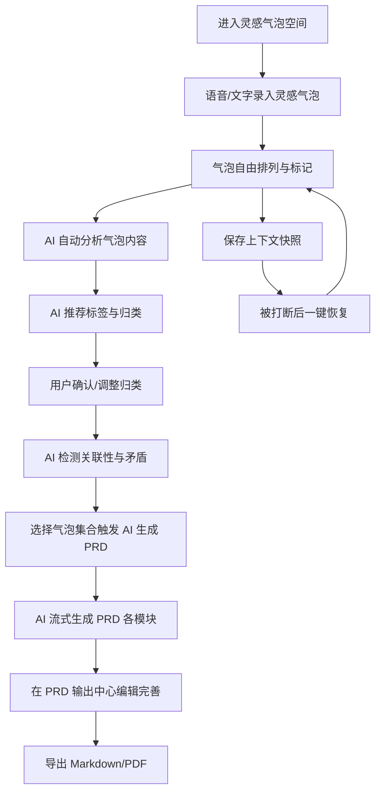

## 1. 产品概述

动态形态 PRD 与认知流场（Dynamic Morphological PRD & Cognitive Flow Space）是一款以气泡为思维载体的 AI 辅助产品管理与创意写作工具。用户通过碎片化文字或语音快速捕捉灵感气泡，AI 自动归类与关联气泡内容，最终辅助生成结构严密的 PRD 文档。
- 核心解决：灵感碎片化、思维被打断、PRD 撰写机械化三大痛点
- 目标用户：产品经理、运营人员、创意策划人员、项目经理
- 核心理念：气泡即思维原子，标签即思维维度，AI 即思维引擎

## 2. 核心功能

### 2.1 用户角色

| 角色 | 注册方式 | 核心权限 |
|------|----------|----------|
| 创意工作者 | 邮箱注册 | 创建与管理气泡、AI 归类与生成、保存上下文快照、导出 PRD |
| 团队协作者 | 邀请注册 | 查看与评论共享气泡、协同编辑 PRD |

### 2.2 功能模块

1. **灵感气泡空间**（核心）：气泡增删改查、语音/文字快速录入、气泡标签与颜色标记、气泡自由拖拽排列、气泡内容关联性检测
2. **AI 智能归类引擎**（核心）：基于 AI 的气泡自动归类、标签智能推荐、气泡内容相关性分析、重复/矛盾气泡检测与提示、AI 辅助 PRD 生成
3. **认知上下文管理**：上下文快照保存与恢复、工作流无缝切换、快照时间线浏览
4. **PRD 输出中心**：AI 辅助 PRD 生成与编辑、多格式导出（Markdown/PDF）、模板选择与自定义

### 2.3 页面详情

| 页面名称 | 模块名称 | 功能描述 |
|----------|----------|----------|
| 灵感气泡空间 | 气泡录入区 | 极简高对比度界面，支持语音和碎片化文字快速录入灵感气泡，回车即生成 |
| 灵感气泡空间 | 气泡画布 | 气泡自由拖拽、缩放、颜色标记、标签分类，双击编辑气泡内容 |
| 灵感气泡空间 | 语音捕捉 | 点击麦克风按钮开始语音录入，自动转文字生成气泡 |
| 灵感气泡空间 | 标签管理栏 | 左侧标签列表，支持标签增删改、颜色自定义，点击筛选对应气泡 |
| 灵感气泡空间 | AI 归类面板 | 右侧面板，展示 AI 自动归类结果，支持一键接受/调整归类，显示归类依据 |
| 灵感气泡空间 | 关联性提示 | 气泡间自动检测内容关联，相关气泡显示虚线连接，矛盾气泡标红提示 |
| 认知上下文管理 | 快照面板 | 一键保存当前思考状态、气泡布局和标签状态，列表展示历史快照 |
| 认知上下文管理 | 时间线视图 | 按时间轴浏览快照历史，可视化工作流切换轨迹 |
| 认知上下文管理 | 快照恢复 | 点击快照一键恢复完整工作状态（画布位置、气泡布局、标签状态） |
| PRD 输出中心 | AI 生成面板 | 选择气泡集合后，AI 自动生成 PRD 各模块内容，支持流式输出 |
| PRD 输出中心 | 文档编辑器 | 左侧 PRD 模块大纲导航，中央编辑区，右侧实时 Markdown 预览 |
| PRD 输出中心 | 导出面板 | 支持 Markdown、PDF 格式导出，模板选择与自定义 |

## 3. 核心流程

用户进入灵感气泡空间，通过语音或碎片化文字快速捕捉灵感气泡。气泡在画布上自由排列，用户可手动打标签或让 AI 自动推荐标签。当气泡积累到一定量后，AI 自动分析气泡内容的相关性，将相关气泡归类到同一分组，检测重复或矛盾内容并提示。用户确认归类后，选择气泡集合触发 AI 辅助 PRD 生成，AI 基于气泡内容流式生成 PRD 各模块（背景、用户故事、需求、数据埋点等）。在 PRD 输出中心编辑完善后导出。过程中可随时通过认知上下文管理保存当前工作状态，被打断后一键恢复。

## 4. 用户界面设计

### 4.1 设计风格

- **主色调**：深邃墨蓝（#0A0E27）为底，搭配荧光青（#00F0FF）与琥珀金（#FFB800）作为强调色，营造"深海思维空间"的沉浸感
- **辅助色**：暗紫灰（#1A1D3A）、深空蓝（#141833）用于层级区分
- **按钮风格**：圆角微光按钮，hover 时发出荧光青光晕，主操作按钮使用琥珀金填充
- **字体**：标题使用 Noto Serif SC（衬线体，传递知识感），正文使用 Noto Sans SC（无衬线，高可读性），代码/标签使用 JetBrains Mono
- **布局风格**：左侧窄导航栏 + 中央大气泡画布 + 右侧 AI 归类面板的三栏布局，画布区域最大化
- **图标风格**：线性图标搭配微光效果，气泡使用发光效果
- **动画**：气泡生成时弹性缩放动画，AI 归类时气泡分组聚合动画，快照切换时淡入淡出过渡

### 4.2 页面设计概览

| 页面名称 | 模块名称 | UI 元素 |
|----------|----------|---------|
| 灵感气泡空间 | 气泡录入区 | 顶部极简输入框 + 麦克风按钮，深色背景，输入框荧光青边框，语音按钮脉冲动画 |
| 灵感气泡空间 | 气泡画布 | 中央无限画布，气泡为圆角胶囊形，不同颜色代表不同标签，相关气泡间虚线连接，双击编辑气泡内容 |
| 灵感气泡空间 | 标签管理栏 | 左侧可折叠标签列表，标签带颜色圆点，支持增删改，点击筛选对应气泡 |
| 灵感气泡空间 | AI 归类面板 | 右侧面板，展示 AI 归类分组，每组显示归类依据与置信度，一键接受/调整按钮 |
| 灵感气泡空间 | 关联性提示 | 相关气泡间自动显示虚线连接，矛盾气泡红色边框闪烁，hover 显示关联原因 |
| 认知上下文管理 | 快照面板 | 右侧可展开面板，快照卡片列表，每张卡片显示缩略图+时间戳+标签，hover 显示预览 |
| 认知上下文管理 | 时间线视图 | 左侧垂直时间线，节点为发光圆点，连线为渐变线，点击节点恢复快照 |
| PRD 输出中心 | AI 生成面板 | 顶部气泡选择器 + 生成按钮，AI 输出区域流式显示生成内容，打字机效果 |
| PRD 输出中心 | 文档编辑器 | 中央编辑区，左侧 PRD 模块大纲导航，右侧实时 Markdown 预览，模块间可拖拽排序 |
| PRD 输出中心 | 导出面板 | 顶部工具栏，导出按钮下拉菜单（Markdown/PDF），模板选择器 |

### 4.3 响应式设计

- 桌面优先设计，最小支持 1280px 宽度
- 平板端（768px-1280px）：右侧 AI 面板折叠为抽屉，画布区域保持最大化
- 移动端（<768px）：单栏布局，底部标签导航，画布支持双指缩放

### 4.4 3D 场景指引

不适用 — 本产品采用 2D 画布 + 发光粒子效果的视觉风格，不涉及 3D 场景。
