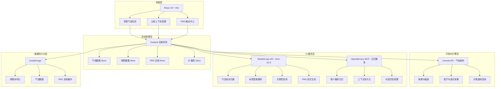
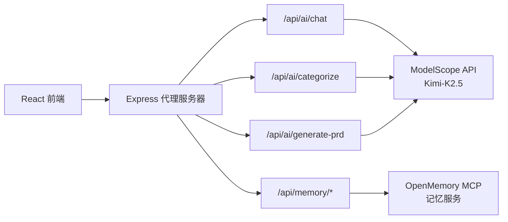
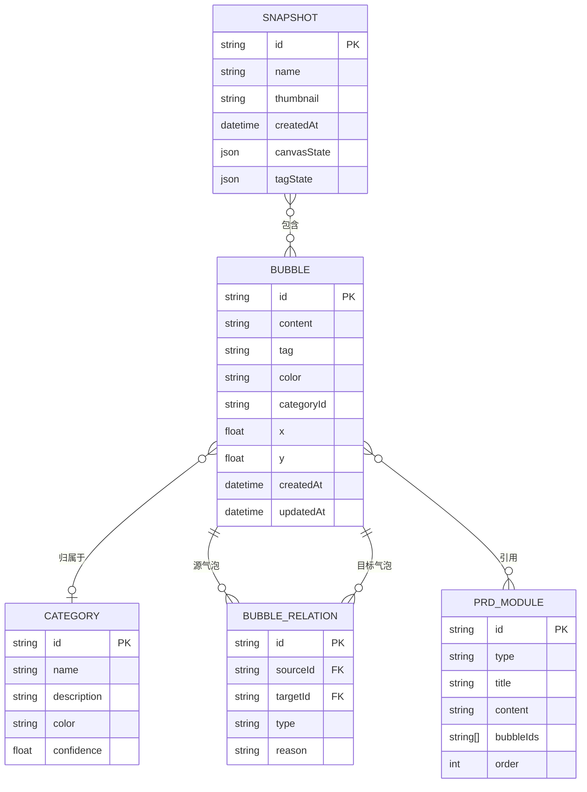

## 1. 架构设计



## 2. 技术说明

- **前端框架**：React@18 + TypeScript + Vite
- **初始化工具**：Vite (react-ts 模板)
- **样式方案**：Tailwind CSS@3 + CSS Modules（用于复杂动画）
- **状态管理**：Zustand（轻量、无 boilerplate）
- **画布渲染**：HTML5 Canvas API（气泡画布、粒子效果、关联虚线）
- **语音识别**：Web Speech API（浏览器原生语音转文字）
- **Markdown 渲染**：react-markdown + remark-gfm
- **PDF 导出**：html2canvas + jsPDF
- **动画库**：framer-motion（UI 过渡动画）
- **AI 大模型**：ModelScope API（moonshotai/Kimi-K2.5），OpenAI 兼容接口
- **AI 记忆服务**：ModelScope OpenMemory MCP（mem0ai），用于用户偏好与上下文记忆
- **后端**：Express@4（代理 AI 请求，避免前端暴露 API Key）
- **数据库**：无（使用 localStorage + 内存数据结构）

## 3. 路由定义

| 路由 | 用途 |
|------|------|
| `/` | 首页/灵感气泡空间，默认入口 |
| `/context` | 认知上下文管理（快照与时间线） |
| `/prd` | PRD 输出中心（AI 生成、编辑与导出） |

## 4. API 定义

### 4.1 后端 API（Express 代理层）

后端作为 AI 服务的代理层，避免前端直接暴露 API Key。

#### 4.1.1 AI 对话接口

```typescript
POST /api/ai/chat

Request:
{
  messages: Array<{ role: 'system' | 'user' | 'assistant'; content: string }>;
  stream?: boolean;
}

Response (stream=true):
Server-Sent Events, 每行格式:
data: { content: string; done: boolean }

Response (stream=false):
{
  content: string;
  usage: { prompt_tokens: number; completion_tokens: number };
}
```

#### 4.1.2 AI 归类接口

```typescript
POST /api/ai/categorize

Request:
{
  bubbles: Array<{ id: string; content: string; tag?: string }>;
  existingTags?: string[];
}

Response:
{
  categories: Array<{
    name: string;
    description: string;
    bubbleIds: string[];
    suggestedTag?: string;
    confidence: number;
  }>;
  suggestedTags: Array<{ name: string; color: string; reason: string }>;
  relations: Array<{
    sourceId: string;
    targetId: string;
    type: 'related' | 'contradictory' | 'duplicate';
    reason: string;
  }>;
}
```

#### 4.1.3 AI PRD 生成接口

```typescript
POST /api/ai/generate-prd

Request:
{
  bubbleIds: string[];
  template?: 'standard' | 'lean' | 'detailed';
  modules?: string[];
}

Response (stream):
Server-Sent Events, 每行格式:
data: { module: string; content: string; done: boolean }
```

#### 4.1.4 记忆服务接口（OpenMemory MCP 代理）

```typescript
POST /api/memory/add

Request:
{
  content: string;
  userId: string;
  metadata?: Record<string, string>;
}

Response:
{
  id: string;
  message: string;
}

GET /api/memory/search?query=xxx&userId=xxx&limit=10

Response:
{
  results: Array<{ id: string; content: string; score: number; metadata: Record<string, string> }>;
}

GET /api/memory/list?userId=xxx

Response:
{
  memories: Array<{ id: string; content: string; metadata: Record<string, string>; createdAt: string }>;
}
```

### 4.2 前端数据操作接口

- `bubbleStore`：气泡的增删改查、标签管理、位置更新、批量归类
- `snapshotStore`：快照的创建、恢复、删除、列表查询
- `prdStore`：PRD 文档的 AI 生成、编辑、模板管理、导出
- `aiStore`：AI 服务状态管理、流式响应处理、记忆查询

## 5. 服务端架构图



## 6. 数据模型

### 6.1 数据模型定义



### 6.2 数据定义语言

```typescript
interface Bubble {
  id: string;
  content: string;
  tag: string;
  color: string;
  categoryId: string;
  x: number;
  y: number;
  createdAt: string;
  updatedAt: string;
}

interface Category {
  id: string;
  name: string;
  description: string;
  color: string;
  confidence: number;
}

interface BubbleRelation {
  id: string;
  sourceId: string;
  targetId: string;
  type: 'related' | 'contradictory' | 'duplicate';
  reason: string;
}

interface PrdModule {
  id: string;
  type: 'background' | 'user_story' | 'flowchart' | 'data_tracking' | 'requirement' | 'custom';
  title: string;
  content: string;
  bubbleIds: string[];
  order: number;
}

interface Snapshot {
  id: string;
  name: string;
  thumbnail: string;
  createdAt: string;
  canvasState: { bubbles: Bubble[]; viewport: { x: number; y: number; zoom: number } };
  tagState: { tags: string[]; categories: Category[] };
}
```
